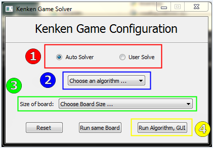
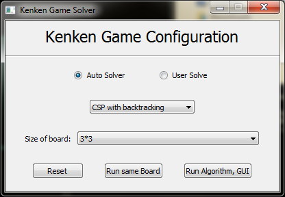
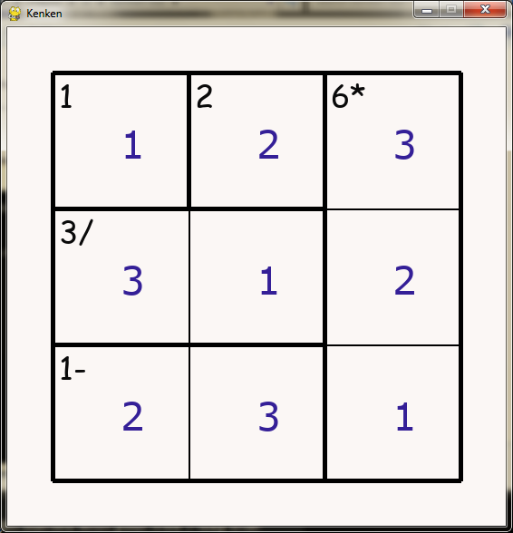
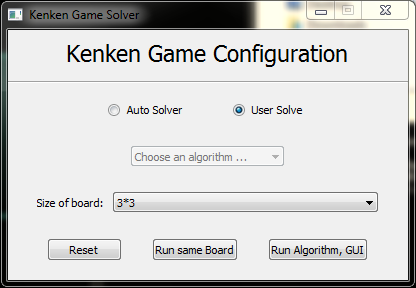
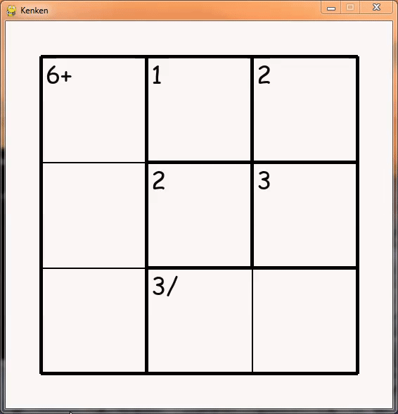

<div id="top"></div>
<h1 align="center"> Kenken Puzzle Solver </h1>
<br />
</div>


Kenken puzzle game can be represented as constraint satisfaction problem.

In this repo we solve this problem using 3 algorithms :

 - Backtracking
 - Backtracking with forward checking
 - Backtracking with arc consistency

## Run Locally

Clone the project

```cmd
  git clone https://github.com/MohamedAhmed412000/Kenken-Puzzle-Solver
```

Install dependencies

```cmd
pip install pygame==2.1.2
pip install PyQt5==5.15.6
```

Start the game
```cmd
  python main.py
```

## Screenshots



1. Choose the type of solver (**User** or **Auto**)
2. Choose the algorithm (**BT** or **FC** or **MAC**)
3. Choose the size of board (available from **3\*3** to **7\*7**)
4. Click on (**Run Algorithm, GUI**) button



- The game will be appeared with the solution.
	


- Also the user can play the game





## Analysis Part

Time analysis in seconds on 100 boards for different sizes on the 3 algorithms.
- BT : backtracking
- FC : backtracking with forward checking
- AC : backtracking with arc consistency

| size  |   BT   |   FC   |   AC   |
| ----- | ------ | ------ | ------ |
| 3 * 3 | 0.284  | 0.3398 | 0.6377 |
| 4 * 4 | 2.9063 | 2.531  | 4.9756 |
| 5 * 5 | 41.003 | 14.927 | 39.132 |
